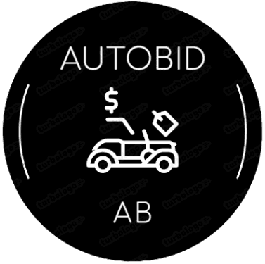

  

---

  
  
  
   
  
   

# Client
Khusus-Client"-aja

o>>> Auto Bid

# Auto Bid Documentation
o> Description
Auto Bid is a Project for managing a collection of cars, allowing users to buy, sell, and view details about their car. This documentation provides details on the available endpoints and how to use them.

# Getting Started
o>  To get started with the Auto Bid, follow these steps for the requirements below:

# Clone the repository.
o> Install dependencies using NPM install.
Set up the database by running migrations with NPM run migrate.
Start the server with NPM start / nodemon.
 
o>> Explore the Project endpoints detailed in  below for requirements.

# Dependencies
o>> This project applies the following dependencies:

o> Express
o> Sequelize
o> Bcrypt
o> Jsonwebtoken
o> Supertest(for testing)
o> Install them using npm install.

 # External APIs
o>  Midtrans
  Midtrans is integrated to handle payment transactions for Users top-ups. Visit the Midtrans documentation for more          information on integrating Midtrans into your project / application.